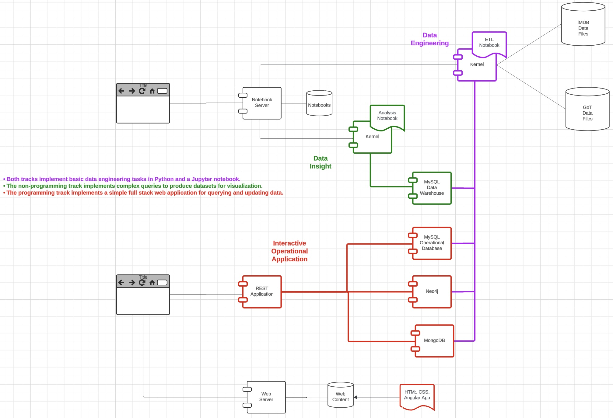

# W4111-Introduction-to-Databases

## Overview

Welcome to the GitHub pages and overview for the GitHub repository for Donald F. Ferguson's section of [W4111-Introduction
to Databases](https://doc.sis.columbia.edu/#subj/COMS/W4111-20251-002/) at Columbia University.
The repository is currently for the spring 2025 semester. The lecture is Friday from 10:10 AM to 12:40 PM in
[207 Math.](https://registrar.columbia.edu/content/mathematics-classroom-information-and-photos)

## Course Overview, Content and Syllabus

### Course Overview

From the course bulletin description, 

"The course covers what a database system is, how to design databases effectively and in a principled manner,
how to query databases, and how to develop applications using databases: entity-relationship modeling, 
logical design of relational databases, relational algebra, SQL, database application development, 
database security, and an overview of query optimization and transaction processing. 

Additional topics generally include NoSQL, graph, object-relational, and cloud databases, as well as data 
preparation and cleaning of real-world data.

The main topics in the course are:
- Understanding the core types of data: _structured, semi-structured,_ and _unstructured._
- How to design good data models, and how to specify them concretely with
[entity-relationship](https://en.wikipedia.org/wiki/Entity%E2%80%93relationship_model) models and tools. This
includes understanding logical, conceptual and physical modeling.
- How to translate and implement data models in specific types of databases.
- The formal, rigorous foundation for data definition and manipulation:
  - [Relational Model](https://en.wikipedia.org/wiki/Relational_model)
  - [Relational Algebra](https://en.wikipedia.org/wiki/Relational_algebra)
  - [Normalization](https://en.wikipedia.org/wiki/Database_normalization)
- How to effectively use relational databases and [Structured Query Language.](https://en.wikipedia.org/wiki/SQL)
- Core concepts in database administration, including data security.
- [NoSQL](https://en.wikipedia.org/wiki/NoSQL) databases: motivation, pros and cons, ... The course provides an
overview of the most common NoSQL models, e.g. documents, graphs, key value, wide column, ... ...
This section of the course provides more detail and experience two NoSQL databases:
  1. [MongoDB](https://en.wikipedia.org/wiki/MongoDB) as an example of document databases.
  2. [Neo4j](https://en.wikipedia.org/wiki/Neo4j) as an example of graph databases.
  3. The course uses "cloud/SaaS" version of the databases, which the course also discussed.
- Database storage mechanisms and storage/access optimization.
- Identifying, defining and using [indexes](https://en.wikipedia.org/wiki/Database_index) to improve database
query performance.
- Implementing data integrity using database definition language constructs, native DB capabilities, and in
application logic.
- The basic concepts of [transactions,](https://en.wikipedia.org/wiki/Database_transaction),
locking, recovery, [consistency models,](https://en.wikipedia.org/wiki/Consistency_model) ... 
- Database scalability and availability.
- [Data engineering](https://en.wikipedia.org/wiki/Data_engineering),
[extract-transform-load]((https://en.wikipedia.org/wiki/Extract,_transform,_load))/[https://en.wikipedia.org/wiki/Extract,_load,_transform], data preparation and
cleansing.
- Data warehouse, data lake
- Practical experience in data engineering using
[Pandas,](https://en.wikipedia.org/wiki/Pandas_(software)) and [PySpark.](https://en.wikipedia.org/wiki/Apache_Spark).
- The "web of interconnected data" and applications, with some details on REST and GraphQL.
- The algorithms and techniques databases management systems use to process and optimize database queries.

### To Program, or not To Program, that is the Question

Students with diverse skills, interests and background data W4111. To accommodate the background and interests,
the course offers both _programming_ and _non-programming_ paths 
for homework and projects. 

The obvious question is, "What constitutes
programming?" It is hard if not impossible to use and work with a database without _some_ programming._ Databases
typically have some form of "programming language" for defining the structure of data and manipulating the data. 
Relational databases use Structured Query _Language._ Neo4j uses the Graph Query _Language,_ and the Cypher query
language. This implies "some programming" is essential in using databases.  

For the purposes of W4111, 

"What does not constitute programming?
- Writing queries for a relational, graph, document, or other data management system does not constitute programming 
and can be expected of all students.

What constitutes programming?
- Reading more than a handful (1-5) lines of code
- Writing code that is not directly required to write a query"

### The Project

|                                         |
|:---------------------------------------:|
|  |
|             __The Project__             |

The instructor builds a simple project during the semester to illustrate many of the concepts the course covers. The
project contains
- A simple, interactive web application that uses databases.
- A simple data engineering and visualization/analysis system.

Students define and incrementally implement their own project during the semester. Each homework assignment contains
tasks that build out the project step-by-step. The instructor's project provides an implementation template and
examples.

## Exams, Homework Assignments and Grading

Students' final grade is in the range of 0 to 100 points. Each homework and exam is worth a specific number of
points. Specifically,
- There are 5 homework assignments, each of which is worth 5 points.
- The midterm is worth 25 points.
- The final exam is worth 50 points.

The midterm and final are "in classroom, written exams."

## Syllabus

This is the tentative syllabus. There may be relatively minor changes.

<iframe src="https://docs.google.com/document/d/e/2PACX-1vT5QIs14arj7yNfrBWCePwqfjD34-oQ76nNT1XZDaRxwMJRTiKrUL3zi2zpgPUkw1X77ZCLF9Cy3mFw/pub?embedded=true" height="900" width="700" scrolling="yes"></iframe>

## Calendar

This is a draft calendar. We will adjust the calendar after discussion to TAs and initial student feedback.

<iframe src="https://calendar.google.com/calendar/embed?src=c_f29a8dd21b7beba8a935795ab394419355f85eafb613a86da455953433b5d2ee%40group.calendar.google.com&ctz=America%2FNew_York" style="border: 0" width="800" height="600" frameborder="0" scrolling="no"></iframe>

## Your Teaching Team

__Under Construction__

|  
|:---------------------------------------------:|
|       __Prof. Donald (Darth) Ferguson__       |

- My nickname at IBM was "Darth Don."
- I love databases and teaching students.
- When you do your homework, remember that _"Slow is smooth. Smooth is fast."_

| 
| :---: |
| __Yuehui (Ricky) Ruan__ |

- Just calling me Ricky is fine!
- Nothing to lose but the delicious food.
- Magic software engineer intern at Hogwarts
  

|  
|:---------------------------------------------:|
|       __Juanita Santofimio__       |

- Senior, Information Sciences
- Excited to meet everyone! Looking forward to seeing you in OH :)

|  
|:---------------------------------------------:|
|       __Aditi Chowdhuri__       |

- Graduate Student (MS in Computer Science)
- I’m an explorer at heart—always on the hunt for cool places to visit.

